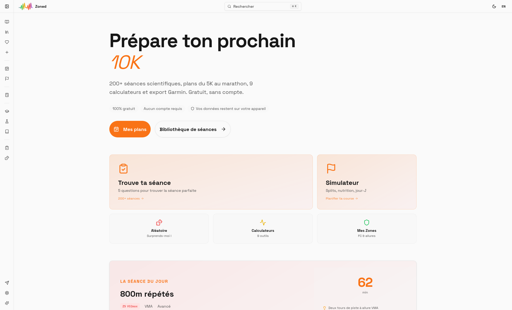
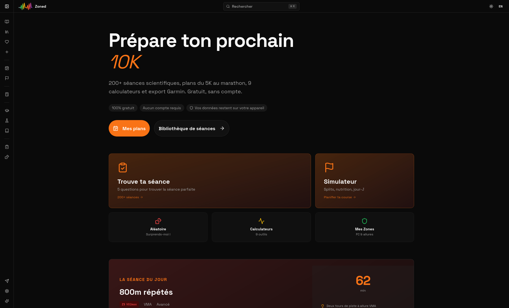
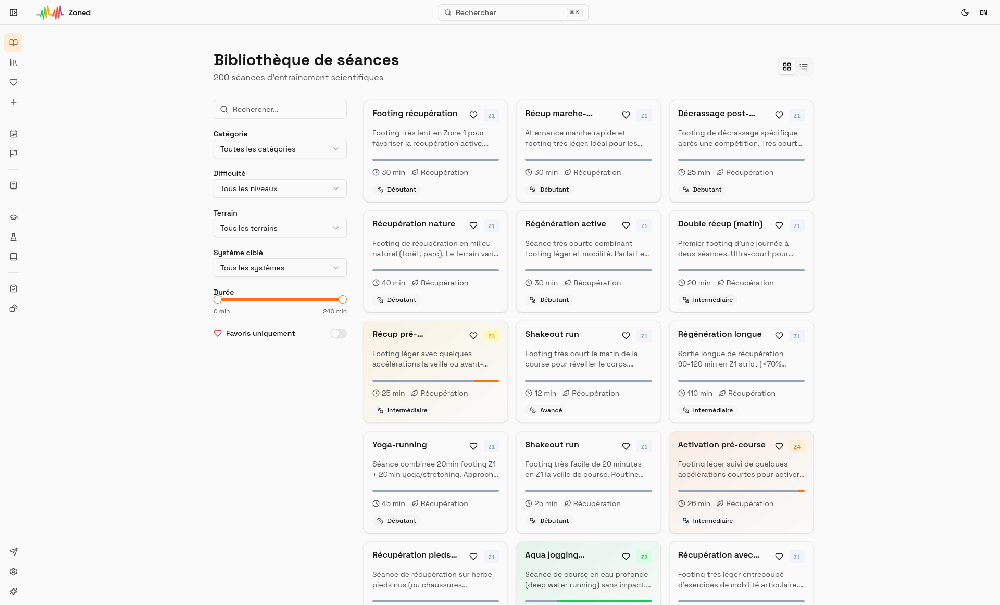
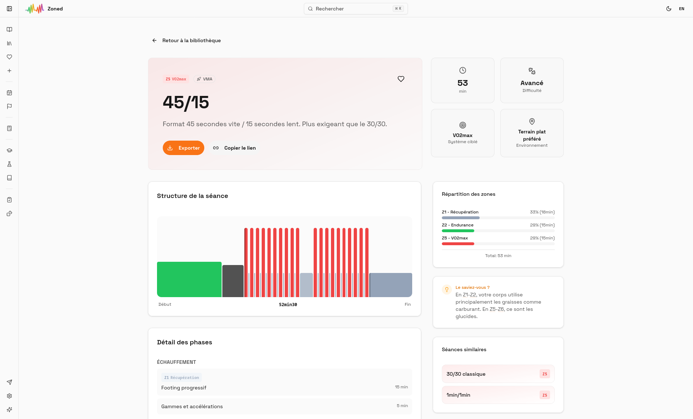
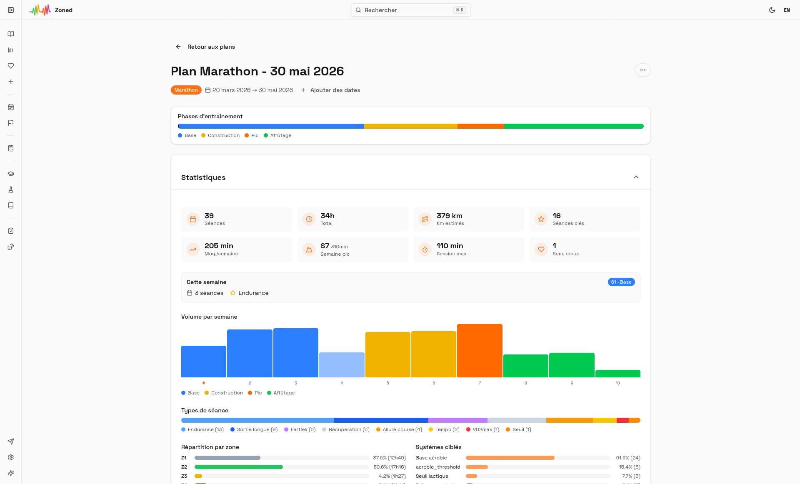

<div align="center">
  

  # Zoned

  **200+ running workouts · 17 strength sessions · 5K to marathon plans · 9 calculators**

  *Free. No account. No tracking.*

  ### [→ zoned.run](https://zoned.run)

  [](LICENSE)
  [](https://github.com/alarboulletmarin/zoned/releases)
  [](CONTRIBUTING.md)
  [](https://vercel.com)
  [](https://react.dev)
  [](https://www.typescriptlang.org/)
  [](https://vite.dev)
  [](https://tailwindcss.com)
</div>

---

## What is Zoned?

Zoned is a free, open-source web app for structured running training. It brings together 200+ science-based running workouts, 17 strength training sessions for runners, personalized training plans from 5K to marathon with integrated strength periodization, and 9 calculators — all running in your browser, with no account and no data sent anywhere.

Built on training science from **Seiler**, **Billat**, and **Daniels**. Developed in collaboration with [Claude Code](https://claude.ai/code) (Anthropic).

---

## Screenshots

<div align="center">
  
  <p><em>Home — Light mode</em></p>

  
  <p><em>Home — Dark mode</em></p>

  
  <p><em>Library</em></p>

  
  <p><em>Workout detail</em></p>

  
  <p><em>Training plan</em></p>
</div>

---

## Features

### Workouts
- **200+ running sessions** across 11 categories: recovery, endurance, tempo, threshold, VMA, long run, hills, fartlek, race pace, mixed, assessment
- **17 strength sessions** for runners: full body, legs, core, plyometrics, mobility, prehab — science-based (Beattie 2017, Rønnestad 2014, Lauersen 2014)
- **46 exercises** with A/B position images, muscle maps, form cues, and progression/regression chains
- **6 training zones**: Z1 (recovery) → Z6 (sprint)
- **Specialized methods**: Norwegian double threshold, Bangsbo 10-20-30, Billat 30/30, Yasso 800s, Cooper/VAMEVAL tests
- **Personalized zones**: Based on your max HR and VMA
- **Custom workout builder**: Create your own sessions block by block (warm-up, main set, cool-down)

### Calculators (9)
Zone calculator · Pace calculator · Pace converter · Pace table · Treadmill converter · Split generator · VMA calculator · Race equivalence · Age-graded calculator

### Training Plans
- **Plan generator**: Personalized multi-week plans (5K to marathon)
- **9 prebuilt plans** with integrated strength training + free mode to build from scratch
- **Strength periodization**: auto-suggested strength sessions adapted to each training phase
- **4 view modes**: Calendar, Weekly, Monthly, List
- **Drag-and-drop** calendar, cross-training support (strength, cycling, swimming, yoga)
- **Export**: PDF, ICS (Google/Apple/Outlook Calendar)
- **Race day simulator**: km-by-km pacing, nutrition timing, checklists

### Discovery
- **Quiz**: Find the right workout in 5 questions (goal, time, terrain, level, weakness)
- **Workout of the Day** · Random workout
- **19 curated collections** (including 3 strength) · Command palette (Cmd+K)
- **Favorites**: Save and organize preferred workouts

### Export
ICS · PNG · PDF · **Garmin FIT** (native workout file for Garmin devices)

### Learn
- **12 bilingual articles** on training principles (Seiler, polarized, threshold...)
- **3 practical guides**: nutrition, race prep, warm-up
- **Methodology** page: the science behind zone-based training
- **Glossary**: 50+ technical terms across 9 categories
- **69 contextual tips** throughout the app

---

## Philosophy

| | |
|---|---|
| **Zero tracking** | No cookies, no user accounts, no server-side data |
| **Local-first** | Everything stays in your browser |
| **Privacy by design** | Only anonymous page views via Vercel Analytics |
| **100% free** | No premium tier, no paywall, ever |

---

## About the author

Runner and developer. I created Zoned to make structured zone-based training accessible to everyone — for free, with no account and no tracking. Every workout, calculator and plan is grounded in training science.

[](https://www.strava.com/athletes/alarboulletmarin)

---

## Getting started

```bash
bun install
bun run dev       # http://localhost:5173
```

```bash
bun run build     # TypeScript check + build to dist/
bun run preview   # Preview production build
```

**Docker:**
```bash
docker compose up -d   # http://localhost:8080
```

---

## Tech stack

| Layer | Tech |
|-------|------|
| Framework | React 19 + Vite 7 |
| Language | TypeScript 5 |
| Styling | Tailwind CSS 4 + shadcn/ui (Radix UI) |
| Charts | Recharts |
| i18n | i18next (FR/EN) |
| PWA | Workbox |
| Analytics | Vercel Analytics (anonymous) |
| Runtime | Bun |

---

## Contributing

Contributions are welcome! See [CONTRIBUTING.md](CONTRIBUTING.md) for how to:
- Submit a workout idea via GitHub issue
- Open a pull request with a new workout (JSON)
- Use the in-app form at [zoned.run/contribute](https://zoned.run/contribute)

---

## Support

If you find Zoned useful, you can support the project on Ko-fi.

[](https://ko-fi.com/T6T01WC5ZC)

---

## License

[MIT](LICENSE)
