<div align="center">
  

  # Zoned

  **Open-source endurance training — workouts, plans, calculators. Runs entirely in your browser.**

  *Free. No account. No tracking. Forever.*

  ### [→ zoned.run](https://zoned.run)

  [](LICENSE)
  [](https://github.com/alarboulletmarin/zoned/releases)
  [](CONTRIBUTING.md)
  [](https://github.com/alarboulletmarin/zoned/issues?q=is%3Aissue+is%3Aopen+label%3A%22good+first+issue%22)
  [](https://github.com/alarboulletmarin/zoned/issues)
  [](https://github.com/alarboulletmarin/zoned/commits/main)
  [](https://github.com/alarboulletmarin/zoned/stargazers)
  <br/>
  [](https://react.dev)
  [](https://www.typescriptlang.org/)
  [](https://vite.dev)
  [](https://tailwindcss.com)
  [](https://bun.sh)

  <br/>

  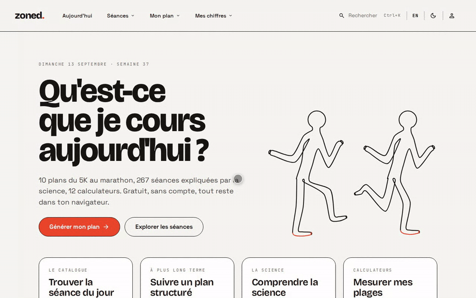
</div>

---

## What is Zoned?

Zoned is a free, open-source web app for structured endurance training. Everything ships in a single static React 19 bundle — there's no backend, no account system and no telemetry beyond anonymous page views. Your zones, favorites and custom workouts stay in `localStorage`.

The catalogue is grounded in published training science (**Seiler**, **Billat**, **Daniels**, **Coggan**, **Bangsbo**, **Beattie**, **Rønnestad**), with every workout, plan and calculator versioned in this repo as plain JSON / TypeScript. It is built in collaboration with [Claude Code](https://claude.ai/code).

| | |
|---|---|
| **219** running workouts | 12 categories from recovery to VMA |
| **17** strength sessions | full body, legs, core, plyometrics, mobility |
| **10** cycling + **10** swimming sessions | Coggan FTP / CSS zones |
| **9** training plans | 5K → marathon, with strength periodization |
| **12** calculators | zones, paces, VMA, FTP, CSS, age-graded, what-if, race-day |
| **15** collections · **12** articles · **50+** glossary terms | bilingual FR / EN |

---

## Demos

<div align="center">
  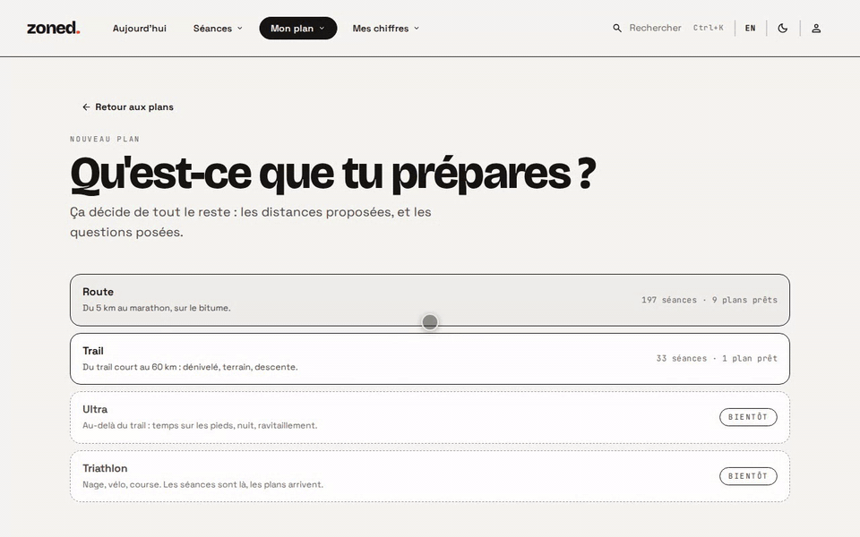
  <p><em>Adopt a prebuilt training plan — phases, stats, then your own calendar</em></p>

  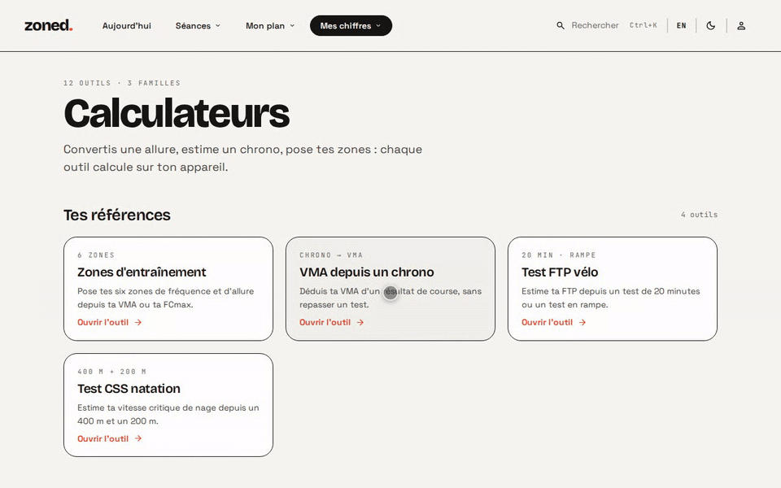
  <p><em>Estimate your VMA from a race time and preview your pace zones</em></p>

  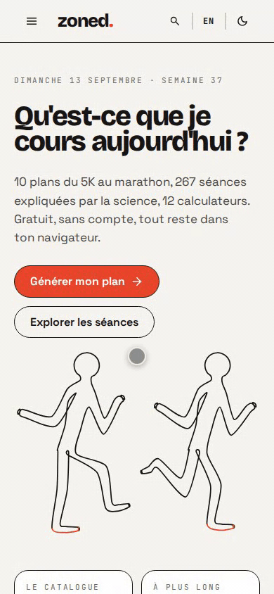
  <p><em>Fully responsive — filter drawer and workout details on mobile</em></p>
</div>

---

## Screenshots

<div align="center">
  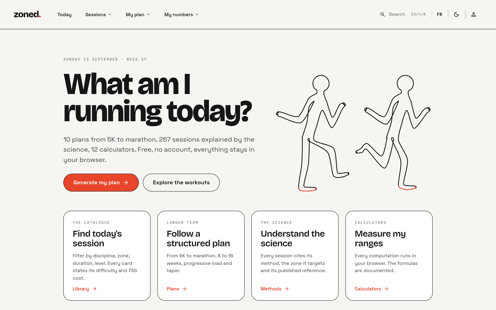
  <p><em>Home — Light mode</em></p>

  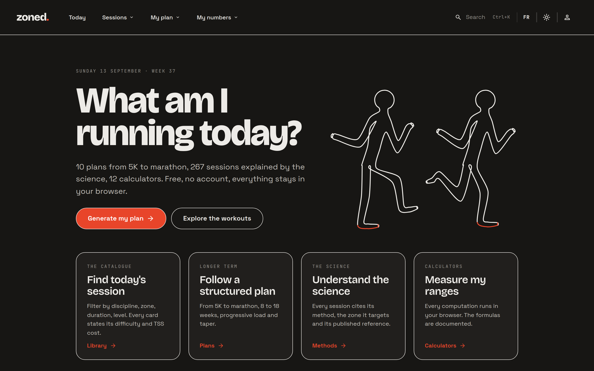
  <p><em>Home — Dark mode</em></p>

  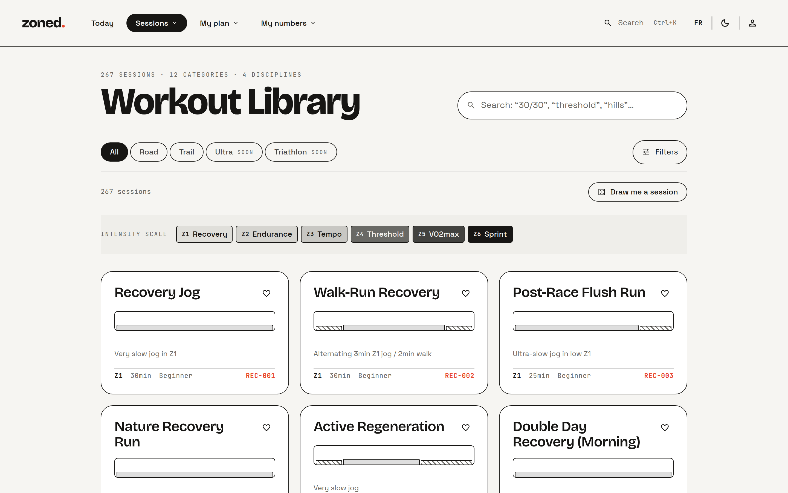
  <p><em>Library</em></p>

  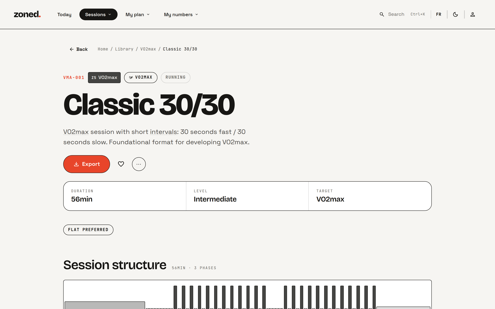
  <p><em>Workout detail</em></p>

  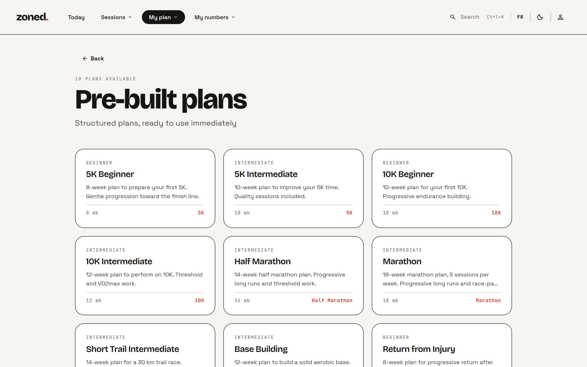
  <p><em>Training plan</em></p>
</div>

### In motion

<table>
  <tr>
    <td align="center" width="33%">
      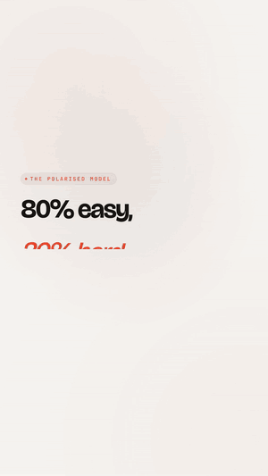<br/>
      <sub><b>The 80/20 model</b><br/>What a well-dosed week looks like</sub>
    </td>
    <td align="center" width="33%">
      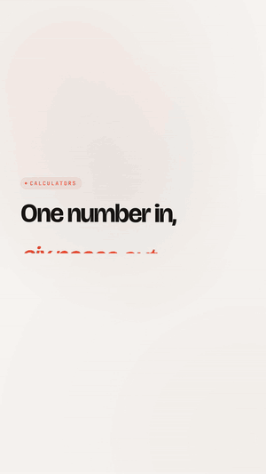<br/>
      <sub><b>Six zones, six adaptations</b><br/>Z1 recovery → Z6 sprint</sub>
    </td>
    <td align="center" width="33%">
      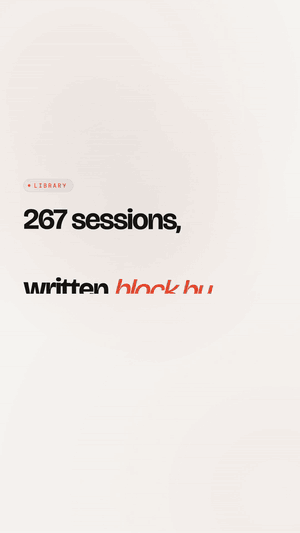<br/>
      <sub><b>Three workouts a week</b><br/>Recovery · VMA · long run</sub>
    </td>
  </tr>
</table>

---

## Features

### Workouts
- **219 running sessions** across 12 categories: recovery, endurance, tempo, threshold, VMA, long run, hills, fartlek, race pace, mixed, trail, assessment
- **10 cycling + 10 swimming sessions** with discipline-aware zones (Coggan FTP, CSS) and cross-discipline substitution in plans
- **17 strength sessions** for runners: full body, legs, core, plyometrics, mobility, prehab — based on Beattie 2017, Rønnestad 2014, Lauersen 2014
- **46 exercises** with A/B position images, muscle maps, form cues, and progression/regression chains
- **6 training zones**: Z1 (recovery) → Z6 (sprint)
- **Specialized methods**: Norwegian double threshold, Bangsbo 10-20-30, Billat 30/30, Yasso 800s, Cooper / VAMEVAL tests
- **Custom workout builder** (`/workout/builder`): assemble sessions block by block (warm-up, main set, cool-down) with undo/redo, then export them like any catalog workout — or share them as JSON (single or bulk export, import with validation)
- **Workout detail pages**: session timeline, zone distribution, personalized pace table, coaching tips, related workouts and science references — with glossary terms linked inline

### Calculators (12)
Training zones · Pace converter · Pace reference table · Treadmill converter · Split generator · VMA from race time · FTP cycling test · CSS swimming test · Race equivalence · Age-graded performance · Race-day simulator · What-if simulator

- **What-if simulator**: compare training scenarios (volume, level, goal) with zone distribution and load preview — scenarios can be named and saved
- **Race-day simulator**: km-by-km pacing, gel/water/electrolyte timing, pre-race checklists (race week, morning, logistics), kit-bag list, saved simulations, PDF export
- **"Race day" view**: a chronological run sheet with a next-up countdown and a *now* marker in the timeline, plus a pace curve for negative and positive split strategies

### Training plans
- **Assisted plan generator**: personalised multi-week plans (5K to marathon) with start date, level and optional intermediate goals (half-way, 4-weeks-out, taper)
- **9 prebuilt plans** with integrated strength training, plus free mode to build from scratch
- **Strength periodization**: auto-suggested strength sessions per training phase
- **4 view modes**: Calendar, Weekly, Monthly, List
- **Drag-and-drop** calendar, cross-training support (strength, cycling, swimming, yoga)
- **Plan audit**: detects imbalanced weeks (missing tempo work, too much intensity…) and proposes one-click fixes
- **Life happens**: block unavailable dates with auto-rescheduling, swap a session for an equivalent one, mark sessions done/skipped, adaptation preview when changing race or start date — all with undo
- **Weekly composer** (`/weeks`): generate a balanced standalone 80/20 week (sessions count, volume, quality session) when you don't want a full plan — lock a session and re-roll the rest
- **10 curated weeks**: first steps, aerobic base, hill block, development block, VO₂max sharpening, race-pace, peak week, big volume, recovery, gentle return — categorised, filterable and duplicable from *My weeks*
- **Export**: PDF, ICS (Google/Apple/Outlook Calendar) — weeks also import/export as JSON

### Routes
- **Route generator**: build a real-world loop or out-and-back from your position
- **POI-aware routing**: waypoints picked from parks, promenades, greenways and beaches via Overpass
- **3 candidates per request**: each with elevation profile, estimated duration and named POI markers
- **Track finder**: locate athletics tracks near you and route to them
- **GPX export** + locally saved routes (`/routes/mine`)
- **Per-session routes**: "Trouver un parcours adapté" on a workout page pre-fills the generator with that session's distance
- **Privacy toggle**: routing is opt-in — no coordinates leave the browser unless you enable it in Settings

### Discovery
- **Workout draw** ("Tirer une séance", `/library/draw`): pull a random session matching your filters (discipline, duration, zones, terrain, equipment…)
- **15 curated collections** grouped by goal (start running, 5K → ultra, speed, strength)
- **Command palette** (Cmd+K): search workouts, articles, glossary terms and pages from anywhere
- **Favorites**: a heart on every workout card (library, collections, draw, quiz results) saves it locally in one click — browse them all on the dedicated `/favorites` page

### Profile & personal records
- **Runner profile** (`/profile`): max HR, VMA, weekly volume, long-run distance and level — used to personalize zones and plans
- **Performance references**: log a race time per distance (5K → marathon) to power VDOT-based equivalences
- **Benchmark history**: record field tests (Cooper, half-Cooper, time trial, lab test) over time, with VMA derived from each result and applied to your zones in one click
- **Personal records**: track PBs per distance with date, label and provenance
- **My zones** (`/my-zones`): your personalized HR + pace zones with a pace converter alongside

### Settings, data & privacy
- **Full backup**: export *all* your data (plans, favorites, custom workouts, zones, profile, routes, scenarios, settings) as a single dated JSON file
- **Restore**: import a backup in **merge** mode (keeps current data) or **replace** mode — with validation and automatic rollback if the import fails
- **Colorblind-safe palettes**: standard, deuteranopia and tritanopia zone color schemes
- **Units**: metric (km, min/km) or imperial (mi, min/mile), applied app-wide
- **Bilingual**: full French / English interface and content; light / dark theme
- **Privacy panel**: plain-language summary of what is stored where (everything in `localStorage`, no server, no account) and the single opt-in network feature (route generation)

### Export & sharing
- **Workouts**: ICS (Google/Apple/Outlook) · PNG · PDF · **Garmin FIT** (native workout file, with on-device transfer guide)
- **Plans**: PDF · ICS — **Routes**: GPX — **Race plan**: PDF — **Custom workouts**: JSON
- **Share by link**: custom workouts, training plans, weeks and race simulations encode into a compact URL — the recipient gets a preview page and a one-click "add to mine". No account, no upload: the whole payload lives in the link
- **Share cards**: multiple social-ready templates per workout (compact, hero, minimal, dark…), copy/download/native share, plus a ready-to-paste Strava description

### Learn
- **12 bilingual articles** on training principles (Seiler, polarized, threshold…)
- **Nutrition hub**: 14 sections covering the 1:0.8 carb ratio, 1.8 g/kg protein target, AIS-classified supplements, caffeine timing, cramps science, heat acclimation, gut training, female-specific needs, debunked myths — sources Witard 2025, Rowlands 2020, Schwellnus, Aragon, Margolis, Paulsen, Trommelen
- **3 practical guides**: nutrition (with fueling calculator), race prep, warm-up
- **Methodology** page and **50+ term glossary** across 9 categories
- **Comparisons** (`/compare`): criterion-by-criterion against Runna, Kiprun Pacer and Campus Coach — price, account requirement, offline use, data ownership
- **69 contextual tips** throughout the app
- **Changelog** page (`/changelog`) with an in-app "what's new" notification after updates

### App
- **Installable PWA** with offline support and in-app update notifications
- **Accessible**: keyboard navigation, screen-reader labels, skip links, `prefers-reduced-motion` respected
- **Fast**: lazy-loaded routes, code-split workout data, infinite-scroll library

---

## Philosophy

| | |
|---|---|
| **Zero tracking** | No cookies, no user accounts, no server-side data |
| **Local-first** | Zones, favorites, custom workouts and routes live in your browser |
| **Privacy by design** | Only anonymous page views via Vercel Analytics |
| **100% free** | No premium tier, no paywall, ever |
| **Open source** | MIT licensed — fork it, host it, audit it |

---

## Getting started

### Run locally

```bash
git clone https://github.com/alarboulletmarin/zoned.git
cd zoned
bun install
bun run dev       # http://localhost:5173
```

```bash
bun run build     # TypeScript check + build to dist/
bun run preview   # Preview production build
```

### Docker

```bash
docker compose up -d   # http://localhost:8080
```

### Self-host

The build output in `dist/` is a static SPA — drop it on any static host (Vercel, Netlify, Cloudflare Pages, GitHub Pages, S3, nginx, Caddy). No environment variables required to run; analytics is opt-in via Vercel.

---

## Project structure

```
src/
├── pages/           # Route components (lazy-loaded)
├── components/      # UI (editorial atoms, domain widgets, visualizations)
├── data/            # JSON workouts + TS catalogues
│   ├── workouts/    # Running / cycling / swimming session JSON, by category
│   ├── strength/    # Strength sessions + exercise library
│   ├── prebuilt-plans/
│   ├── collections/
│   └── articles/    # Bilingual editorial content
├── hooks/           # React hooks (useWorkouts, useAppStats, …)
├── lib/             # Pure helpers (zones, pacing, exports, storage)
├── i18n/locales/    # FR / EN translation namespaces
└── types/           # WorkoutTemplate, Plan, Zone, etc.
```

Want a high-level tour of how a workout flows from JSON to the rendered detail page? Start at [`src/types/index.ts`](src/types/index.ts) (the `WorkoutTemplate` shape) → [`src/data/workouts/`](src/data/workouts/) (the JSON) → [`src/hooks/useWorkouts.ts`](src/hooks/useWorkouts.ts) → [`src/pages/WorkoutDetailPage.tsx`](src/pages/WorkoutDetailPage.tsx).

---

## Tech stack

| Layer | Tech |
|-------|------|
| Framework | React 19 + Vite 7 |
| Language | TypeScript 5 |
| Styling | Tailwind CSS 4 + shadcn/ui (Radix UI) |
| Animations | framer-motion (respects `prefers-reduced-motion`) |
| Charts | Recharts |
| i18n | i18next (FR / EN) |
| PWA | Workbox |
| Analytics | Vercel Analytics (anonymous page views only) |
| Runtime | Bun |

---

## Contributing

Contributions are very welcome — coaches, runners, devs, designers. **No need to be a developer:** the easiest way is to share a workout idea via a GitHub issue.

**Ways to contribute, easiest first:**

| | |
|---|---|
| 💡 **Suggest a workout** | Open a [workout idea issue](https://github.com/alarboulletmarin/zoned/issues/new?template=workout_idea.md) — no JSON required |
| 🐛 **Report a bug** | Use the [bug report template](https://github.com/alarboulletmarin/zoned/issues/new?template=bug_report.md) |
| 🌍 **Improve a translation** | Edit a file in [`src/i18n/locales/`](src/i18n/locales/) and open a PR |
| 📝 **Write or refine an article** | Add or improve content in [`src/data/articles/content/`](src/data/articles/content/) |
| 🏋️ **Submit a full workout** | Add JSON in [`src/data/workouts/`](src/data/workouts/) — see [CONTRIBUTING.md](CONTRIBUTING.md) for the schema |
| 🎨 **UI / UX polish** | Pick a [`good first issue`](https://github.com/alarboulletmarin/zoned/issues?q=is%3Aissue+is%3Aopen+label%3A%22good+first+issue%22) |
| 📚 **Improve the methodology page** | Citations and clarity always welcome |

The in-app contribution form lives at [zoned.run/contribute](https://zoned.run/contribute) and pre-fills the right issue template.

**Before opening a PR**, please:

```bash
bun run build         # type check + production build
bun run check:i18n    # FR / EN parity check
```

See [CONTRIBUTING.md](CONTRIBUTING.md) for workout ID conventions, the `WorkoutTemplate` schema, and the bilingual policy. By participating you agree to the [Code of Conduct](CODE_OF_CONDUCT.md). Found a security issue? Please report it privately — see [SECURITY.md](SECURITY.md).

---

## Roadmap

Tracked publicly in [GitHub Issues](https://github.com/alarboulletmarin/zoned/issues) and the [Releases](https://github.com/alarboulletmarin/zoned/releases) page. Recent waves:

- **0.5.x** — multi-discipline (cycling / swimming), route generator, strength periodization
- **next** — additional bilingual articles, more curated collections, broader plan library, deeper trail metrics

Feature requests are welcome via issues.

---

## About the author

Runner and developer. I created Zoned to make structured zone-based training accessible to everyone — for free, with no account and no tracking. Every workout, calculator and plan is grounded in training science.

[](https://www.strava.com/athletes/115001213)
[](https://github.com/alarboulletmarin)

---

## Support

If Zoned helps you train, you can support the project on Ko-fi — entirely optional.

[](https://ko-fi.com/T6T01WC5ZC)

A ⭐ on the repo is also greatly appreciated and helps other runners find the project.

---

## License

[MIT](LICENSE) — free to use, fork, host or adapt. Attribution is appreciated.

**MIT covers Zoned's own source code.** Third-party material keeps its own terms:

| | |
|---|---|
| [Material Symbols](https://github.com/google/material-design-icons) | icon set, © Google, Apache 2.0, paths unmodified but repackaged |
| [Space Grotesk](https://github.com/floriankarsten/space-grotesk) | typeface, © 2020 the project authors, SIL OFL 1.1, latin subset |
| **[Garmin FIT SDK](https://developer.garmin.com/fit/)** | **`.fit` export, © Garmin — proprietary, not open source** |

The Garmin SDK is the one piece MIT does not reach: it is a runtime dependency
that the build serves to visitors, under Garmin's own agreement rather than this
licence. **If you fork or self-host, read its terms before you redistribute** —
they restrict passing the SDK on to third parties. It sits behind a single dynamic
import in `src/lib/export/fit.ts`; dropping FIT export drops the constraint.

Full notices in [THIRD-PARTY.md](THIRD-PARTY.md). The licences of every bundled
npm dependency are generated at build time and served at
[zoned.run/licenses.txt](https://zoned.run/licenses.txt).
